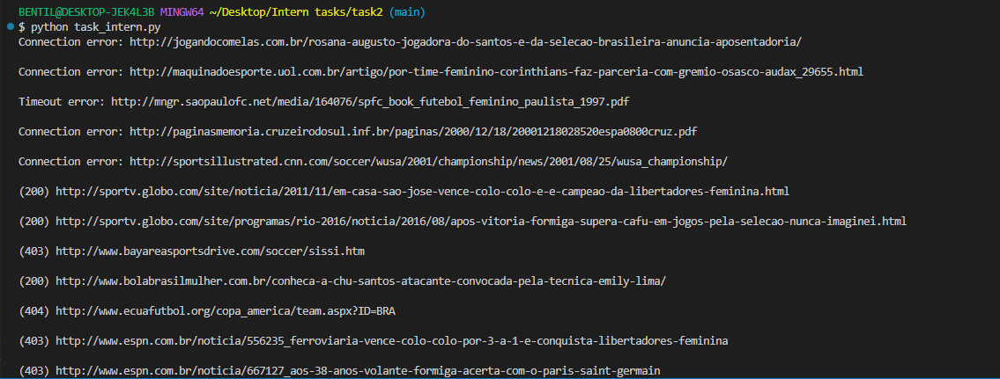

# Addressing the new Lusophone Technological Wishlist Proposals - Task 2

## Overview

This task is part of **Outreachy 30: Addressing the new Lusophone Technological Wishlist Proposals (T386128)**. The goal is to create a Python script that reads a list of URLs from a CSV file and checks their HTTP status codes.

## Task Objective

- Read a CSV file containing a list of URLs.
- Make HTTP requests to each URL.
- Print the HTTP status code and the corresponding URL in a formatted output.

## Requirements

- A GitHub account.
- Python installed.
- Required libraries: `requests`, `csv`, and `pandas`.

## Steps to Complete the Task

1. **Download the CSV file**:

   - `Task 2 - Intern.csv` (provided in the task description).

2. **Write a Python script**:

   - Open and read the CSV file.
   - Extract the URLs from the first column.
   - Make HTTP requests to each URL and fetch the response status code.
   - Format the output as:
     ```
     (STATUS CODE) URL
     ```
     Example:
     ```
     (200) https://www.nytimes.com/1999/07/04/sports/women-s-world-cup-sissi-of-brazil-has-right-stuff-with-left-foot.html
     ```

3. **Handle Errors**:

   - Use `try-except` blocks to catch network-related errors.
   - Print meaningful messages for timeouts, SSL errors, or unreachable websites.

4. **Run and Verify**:

   - Execute the script using:
     ```sh
     python script.py
     ```
   - Ensure correct status codes are retrieved.

5. **Output**
   
